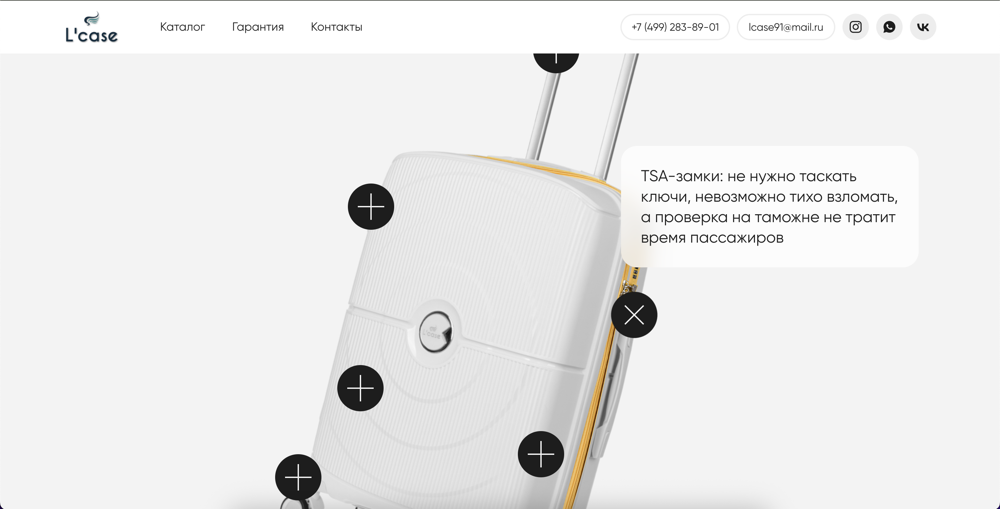

# Animation Module for Tilda on HTML, JS and CSS

## Описание
Кастомный анимационный модуль для платформы **Tilda**, созданный для визуальной демонстрации структуры объекта (в данном случае — чемодана). При нажатии на подсказки (тултипы) определённые части чемодана подсвечиваются, что позволяет интерактивно знакомить пользователя с его составом.

Подобный подход отлично подходит для:
- демонстрации продуктов в разрезе,
- визуализации характеристик устройства,
- обучающих интерфейсов.

## Функционал
- Подсветка определённых зон изображения по нажатию на связанные тултипы
- Гибкое управление активными элементами через JavaScript
- Плавная CSS-анимация для выделения частей
- Простая интеграция в Tilda через HTML-блок с кодом
- Возможность масштабирования под другие объекты/сценарии

## Технологии
- HTML5
- CSS3 (анимации, transitions)
- JavaScript (ES6+)
- Платформа Tilda

## Пример использования

### Как работает:
1. Пользователь нажимает на тултип рядом с изображением чемодана.
2. Соответствующая часть чемодана визуально подсвечивается.
3. Повторное нажатие снимает подсветку или переключает её на другой элемент.

### Пример визуальной структуры

*Подсвечивание частей чемодана при нажатии на тултип.*
